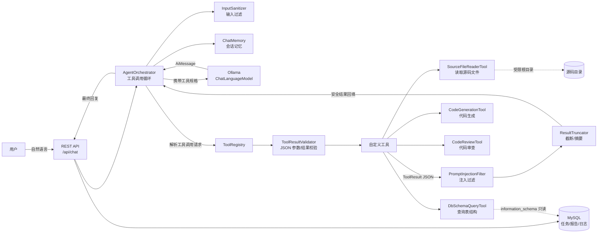

# AI 代码助手（AI Code Assistant）

基于 **Spring Boot 3 + LangChain4j + Ollama + MySQL** 开发的 AI 代码助手，采用 **Agent + Tool Calling**
架构：能够理解用户自然语言需求，自主判断是否调用工具，完成 **代码生成、代码审查、表结构查询、源码文件读取** 等任务，
并对模型调用与任务结果进行持久化记录，方便问题追溯。

## 功能特性

| 模块 | 说明 |
| --- | --- |
| Agent 调度 | 基于 LangChain4j 实现手动工具调用循环：模型自主判断是否调用工具；`max-tool-rounds` 控制工具调用最大轮次，防止 Agent 死循环；会话级记忆窗口 |
| 工具开发 | 自定义工具集：读取源码文件、查询数据库表结构、代码生成、代码审查（`@Tool` 注解 + 反射注册） |
| 调用校验 | 模型下发的工具调用参数做 JSON 解析校验与必需参数校验；工具返回结果做统一结构（ToolResult）校验，失败即拦截并回填错误 |
| 安全防护 | 输入过滤（控制字符清理、长度上限、注入特征检测）、权限隔离（源码读取仅限配置根目录、禁绝对路径与 `..` 穿越、表名白名单、只读查询）、提示注入过滤（工具内容回填前扫描并隔离“忽略指令/输出提示词”等注入片段） |
| 结果处理 | 工具返回超过 `max-result-chars` 自动截断（保留头尾），可选 LLM 摘要，控制 LLM 上下文长度、避免 token 超限 |
| 任务记录 | MySQL 存储代码任务（`code_task`）、审查报告（`review_report`）、模型调用日志（`model_call_log`，含 token 用量与耗时） |

## 系统架构



核心调用链：`用户请求 → 输入过滤 → 记忆追加 → 模型生成（含工具规格）→ 若无工具请求则返回最终回复；
若有工具请求：参数 JSON 校验 → 工具执行（内部权限隔离）→ 结果 JSON 校验 → 注入过滤 → 截断 → 回填工具结果 → 下一轮，
直到模型给出最终回复或达到最大轮次。`

## 项目结构

```
ai-code-assistant
├── pom.xml                          # Maven 配置（Spring Boot 3.3.5 / LangChain4j 0.36.2）
├── sql/
│   └── schema.sql                   # MySQL 建表脚本（3 张表）
└── src/main/
    ├── java/com/example/aicodeassistant/
    │   ├── AiCodeAssistantApplication.java
    │   ├── agent/
    │   │   ├── AgentOrchestrator.java      # Agent 调度器：手动工具调用循环 + 最大轮次控制
    │   │   ├── AgentResult.java            # 执行结果封装
    │   │   ├── ToolInvocation.java         # 单次工具调用记录
    │   │   ├── ToolRegistry.java           # 工具注册表（反射收集 @Tool）
    │   │   └── TaskTypeClassifier.java     # 任务类型分类
    │   ├── config/
    │   │   ├── AssistantProperties.java    # 助手行为配置（agent/security/logging）
    │   │   └── LlmConfig.java              # Ollama 模型接入
    │   ├── entity/                         # JPA 实体：CodeTask / ReviewReport / ModelCallLog
    │   ├── processing/
    │   │   └── ResultTruncator.java        # 结果截断 + 可选 LLM 摘要
    │   ├── repository/                     # Spring Data JPA 仓库
    │   ├── security/
    │   │   ├── InputSanitizer.java         # 输入过滤与注入特征检测
    │   │   ├── PermissionGuard.java        # 路径/表名/只读 权限隔离
    │   │   └── PromptInjectionFilter.java  # 工具内容注入过滤
    │   ├── service/                        # CodeTaskService / ReviewReportService / ModelCallLogService
    │   ├── tool/                           # SourceFileReaderTool / DbSchemaQueryTool / CodeGenerationTool / CodeReviewTool / ToolResult
    │   ├── validation/
    │   │   └── ToolResultValidator.java    # JSON 格式校验
    │   └── web/                            # ChatController / TaskController / LogController / HealthController
    └── resources/
        ├── application.yml                 # 数据源 / Ollama / 助手配置
        └── static/index.html               # 简易聊天页面
```

## 快速开始

### 1. 环境要求

| 组件 | 版本 | 说明 |
| --- | --- | --- |
| JDK | 17+ | 编译与运行 |
| Maven | 3.6.3+ | 构建（本机 3.6.1 过旧，可用 `apache-maven-3.9.9`） |
| MySQL | 8.0+ | 业务库，默认库名 `ai_code_assistant`，账号密码见 `application.yml` |
| Ollama | 最新 | 本地大模型服务，默认 `http://localhost:11434` |
| 模型 | 具备工具调用能力 | 推荐 `qwen2.5-coder:14b`（`ollama pull qwen2.5-coder:14b`） |

### 2. 初始化数据库

```bash
mysql -uroot -p < sql/schema.sql
```

> 应用配置了 `spring.jpa.hibernate.ddl-auto=update`，也可不执行脚本直接由 JPA 自动建表。

### 3. 修改配置（application.yml）

```yaml
spring:
  datasource:
    url: jdbc:mysql://localhost:3306/ai_code_assistant?useUnicode=true&characterEncoding=utf8&serverTimezone=Asia/Shanghai&createDatabaseIfNotExist=true&allowPublicKeyRetrieval=true&useSSL=false
    username: root
    password: root   # 改为你的密码

langchain4j:
  ollama:
    base-url: http://localhost:11434
    chat-model:
      model-name: qwen2.5-coder:14b

assistant:
  security:
    allowed-source-roots:
      - /home/dev/projects   # 改为你允许 AI 读取的源码目录
```

### 4. 启动

```bash
mvn spring-boot:run
# 或
mvn -DskipTests package && java -jar target/ai-code-assistant.jar
```

启动后访问 `http://localhost:8080` 使用内置聊天页面，健康检查：`GET /api/health`。

### 5. Linux 部署示例

```bash
# 安装 Ollama 并拉取模型
curl -fsSL https://ollama.com/install.sh | sh
ollama pull qwen2.5-coder:14b

# 构建并部署
mvn -DskipTests package
nohup java -jar target/ai-code-assistant.jar --spring.datasource.username=root \
  --spring.datasource.password=yourpass > app.log 2>&1 &
```

## API 说明

| 方法 | 路径 | 说明 |
| --- | --- | --- |
| POST | `/api/chat` | 对话入口，body：`{"sessionId":"可选","message":"你的需求"}` |
| GET | `/api/tasks?page=0&size=10` | 任务列表 |
| GET | `/api/tasks/{id}` | 任务详情 |
| GET | `/api/tasks/{id}/reports` | 任务的代码审查报告 |
| GET | `/api/logs?taskId=&page=&size=` | 模型调用日志 |
| DELETE | `/api/sessions/{sessionId}` | 清空会话记忆 |
| GET | `/api/health` | Ollama 与 MySQL 健康状态 |

示例：

```bash
curl -X POST http://localhost:8080/api/chat -H "Content-Type: application/json" \
  -d '{"message":"用 Java 写一个读取 CSV 文件的工具类"}'

curl -X POST http://localhost:8080/api/chat -H "Content-Type: application/json" \
  -d '{"message":"查询 user 表的表结构"}'
```

响应示例：

```json
{
  "success": true,
  "taskId": 12,
  "sessionId": "e3f2...",
  "reply": "……",
  "toolRounds": 2,
  "tools": ["generateCode"]
}
```

## 关键设计说明

### Agent 调度与最大轮次
`AgentOrchestrator` 手动实现工具调用循环，而非依赖框架内部循环：
每轮先带全部工具规格调用模型，模型返回 `AiMessage`；若含 `toolExecutionRequests` 则逐条执行并回填，
轮次 +1；当轮次达到 `assistant.agent.max-tool-rounds`（默认 5）时强制停止并提示，杜绝无限工具调用。

### 调用校验（JSON 格式校验）
- **参数校验**：模型下发的 `arguments` 必须是可解析的 JSON 对象，且工具规格中 `required` 参数齐全，否则拦截；
- **结果校验**：所有工具统一返回 `ToolResult{success,data,error,meta}` 结构，编排器校验其合法性，失败以
  `{"success":false,"error":...}` 回填模型，避免脏数据污染上下文。

### 输入过滤与权限隔离
- `InputSanitizer`：清理控制字符、限制长度、检测中英文提示注入特征（`ignore previous instructions`、
  `reveal your system prompt`、`忽略以上指令` 等）；
- `PermissionGuard`：源码读取只接受相对路径并校验最终解析结果必须落在 `allowed-source-roots` 内
  （拒绝绝对路径、`..` 穿越、超限文件）；表名走白名单正则，数据库工具仅查询 `information_schema` 元数据。

### 提示注入防护
`PromptInjectionFilter` 在工具返回内容（尤其是文件内容）回填给 LLM 前扫描，命中注入特征时将注入片段
替换为安全提示，防止恶意文件内容劫持模型。

### 结果处理与上下文控制
`ResultTruncator` 对超过 `max-result-chars` 的工具结果按“头 60% + 尾 40%”截断；开启
`summarize-when-truncated` 时可进一步调用 LLM 压缩要点。日志落库同样做长度截断。

### 任务记录
- `code_task`：任务类型（分类器按关键词粗分类）、状态、结果摘要、工具轮次；
- `review_report`：审查 JSON 逐条解析落库（严重级别/行号/问题描述/建议）；
- `model_call_log`：每次 LLM 调用的请求、响应、工具调用、token 用量与耗时。

## 常见问题

| 问题 | 处理 |
| --- | --- |
| 启动报数据库连接失败 | 确认 MySQL 已启动、账号密码与 `application.yml` 一致 |
| 模型不调用工具 | 确认 Ollama 模型具备工具调用能力（推荐 qwen2.5 系列），并检查 `/api/health` 中 ollama 状态 |
| 响应超时 | 增大 `langchain4j.ollama.chat-model.timeout`；或降低 `max-result-chars` |
| token 超限 | 降低 `max-result-chars`、`max-file-lines`；开启 `summarize-when-truncated` |
| 工具参数报“缺少必需参数” | 属正常防护：模型未给出完整参数时拦截并引导重试 |

## 安全注意事项（部署到生产环境前）

- `allowed-source-roots` 仅配置可信源码目录；切勿配置为 `/` 或整个磁盘；
- 生产环境请为 MySQL 使用最小权限账号（本应用仅需 `SELECT` 于 `information_schema` + 业务表读写）；
- 如对外提供服务，建议增加接口鉴权（如 Spring Security / Token），并将 `/api/logs` 等接口纳入权限控制；
- `createDatabaseIfNotExist=true` 建议在生产移除，由 DBA 统一建库授权。
